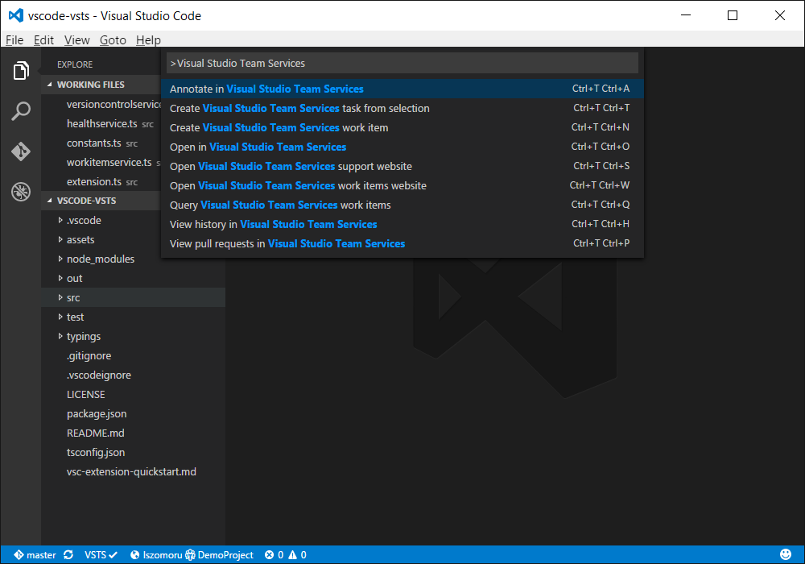
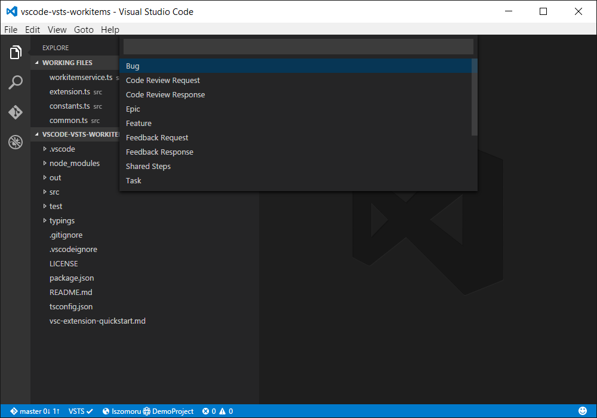
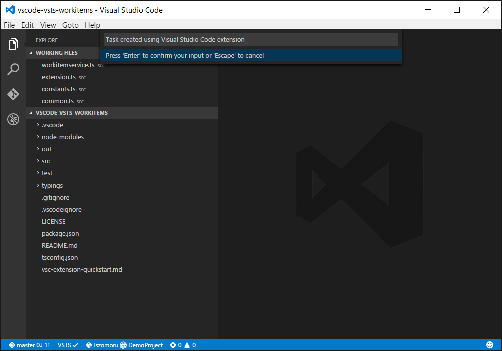
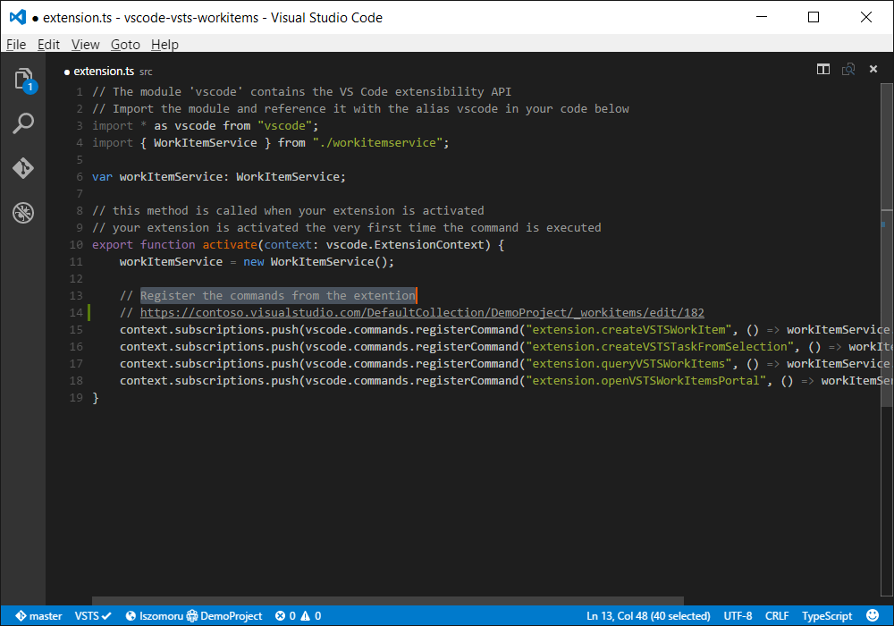
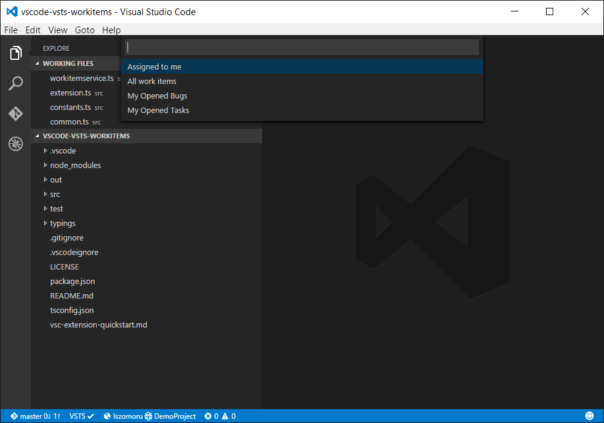
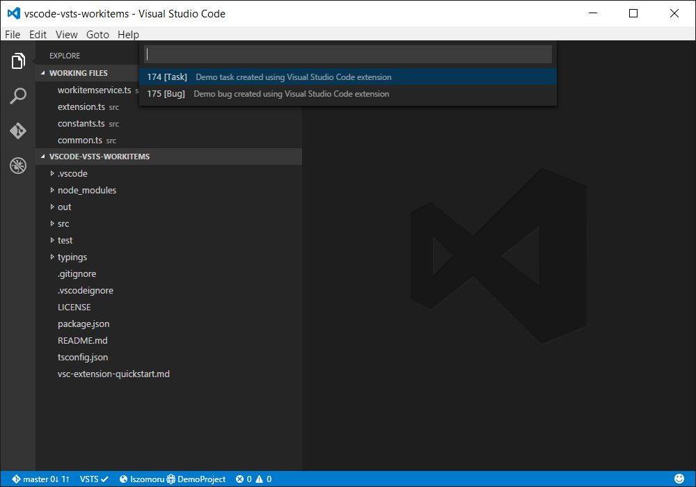

# Visual Studio Team Services extension
Using the Visual Studio Team Services extension for Visual Studio Code you can keep an eye on the health of Visual Studio Team Services using the status bar indicator as well as use the commands from the [command palette](https://code.visualstudio.com/docs/editor/codebasics#_command-palette) to perform version control, and work item tracking actions against your Visual Studio Team Services acount.

## Features
The features are available through the commands that were added to the [command palette](https://code.visualstudio.com/Docs/editor/codebasics#_command-palette) as well as the [key bindings](https://code.visualstudio.com/docs/customization/keybindings) associated with each: *Open Visual Studio Team Services support website (`Ctrl+V Ctrl+S`)*, *Open Visual Studio Team Services work items website (`Ctrl+V Ctrl+W`)*, *Create Visual Studio Team Services work item (`Ctrl+V Ctrl+N`)*, *Create Visual Studio Team Services task from selection (`Ctrl+V Ctrl+T`)*, *Query Visual Studio Team Services work items (`Ctrl+V Ctrl+Q`)*, *Open in Visual Studio Team Services (`Ctrl+V Ctrl+O`)*, *Annotate in Visual Studio Team Services (`Ctrl+V Ctrl+A`)*, *View history in Visual Studio Team Services (`Ctrl+V Ctrl+H`)*, *View pull requests in Visual Studio Team Services (`Ctrl+V Ctrl+P`)*.

### Visual Studio Team Services health, account, and team project indicators
Based on the settings in ```settings.json``` two visual indicators are added to the Visual Studio Code status bar. One for the health of Visual Studio Team Services and one for the Visual Studio Team Service account/team project that the extension is connected to. Clicking the service health indicator will open the support website, while clicking the account/team project indicator will open the work item management website.

### Create new work item


### Create task from selection
Create a new Visual Studio Team Services task from a single-line text selection to easily track tasks from comments. A link to the newly created task will be automatically injected into the editor. This feature is only available for JavaScript, TypeScript, TypeScript React, and C# files.

### Query work items
Execute a work item querie stored in the "My Queries" folder and open a work item that is returned by the query.


### Open/annotate file, view history/pull requests
While working with a Git repository hosted in Visual Studio Studio Team Services, you can open the repository or the curren file, annotate the current file, view the history of the repository or the current file, and view pull requests right from within Visual Studio Code. 

## Installation
Before [installing](https://code.visualstudio.com/docs/editor/extension-gallery#_browse-extensions) this extension, if you have installed any of the two extensions listed below, please  [uninstall](https://code.visualstudio.com/docs/editor/extension-gallery#_uninstall-an-extension) them as the features included in those extensions have been ported into this extension along with extra functionality that is availability only in this extension.
* [Visual Studio Team Services health indicator](https://marketplace.visualstudio.com/items/lszomoru.vscode-vsts-status)
* [Visual Studio Team Services work item management extension](https://marketplace.visualstudio.com/items/lszomoru.vscode-vsts-workitems)

## Configuration 
In order for the extension to access your Visual Studio Team Servies account you need to provide the account name, team project name, and a [personal access token](https://www.visualstudio.com/en-us/news/2015-jul-7-vso.aspx) with "work items (read and write)" permission. After installing the extension, and restarting Visual Studio Code, add the following settings into ```settings.json```:
```
	// Visual Studio Team Services account (Ex: contoso.visualstudio.com).
	"vsts.account": "",

	// Visual Studio Team Services personal access token.
	"vsts.pat": "",

	// Visual Studio Team Services team project name.
	"vsts.teamProject": ""
```
Additionally you can add an optional setting to control the work item types that can be created using Visual Studio Code.
```
	// Visual Studio Team Services work item types. (Ex: ["Bug", "Task"])
	"vsts.workItemTypes": [],
```

## Changelog
### v0.0.1
* Visual Studio Team Services health, account, and team project indicators on the status bar
* Open Visual Studio Team Services work items portal
* Create/query Visual Studio Team Services work items
* Create new task from a single-line text selection (JavaScript, TypeScript, TypeScript React, C#)
* Open/annotate file, view history/pull requests in Visual Studio Team Services

## License
MIT. For more details check [LICENSE](LICENSE).
